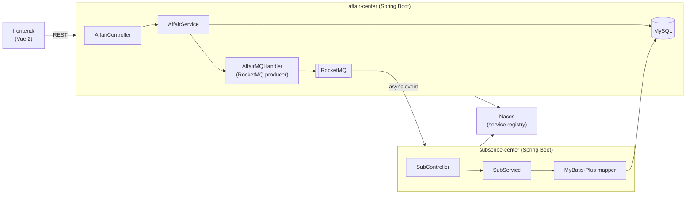

# ems · Spring Cloud Alibaba + Vue 2 Event Management Full-Stack

> **Full-stack Event Management System — Spring Cloud Alibaba microservices (Nacos discovery, RocketMQ async, MyBatis-Plus) + Vue 2 frontend in `frontend/`.**
>
> 全栈活动管理系统：Spring Cloud Alibaba 微服务（Nacos 注册发现、RocketMQ 异步消息、MyBatis-Plus）+ Vue 2 前端 (`frontend/`)，affair-center 与 subscribe-center 双服务解耦。

[English](#english) · [中文](#中文)


---

<a id="english"></a>

## Architecture



## Quickstart

```bash
# Backend
# 1. Start Nacos + RocketMQ + MySQL
# 2. Configure application.yml for each service (DB, nacos.server-addr, rocketmq.name-server)
cd affair-center && mvn spring-boot:run &
cd subscribe-center && mvn spring-boot:run

# Frontend (Vue 2)
cd frontend && npm install && npm run serve
```

## Service Overview

| Service | Port | Responsibility |
|---|---|---|
| `affair-center` | 8081 | Event CRUD, RocketMQ producer |
| `subscribe-center` | 8082 | Subscription management, MQ consumer |
| `framework` | — | Shared entities, base classes, Result wrapper |

## Technical Highlights

<details>
<summary><b>RocketMQ decoupled event notification</b></summary>

- **S**: When a new event (affair) is created or updated, all subscribers need to be notified — synchronous notification would block the create request.
- **A**: `AffairMQHandler` publishes an event message to RocketMQ after the DB write. `subscribe-center` consumes the message asynchronously via `AffairMQTransactionHandler`. Transactional message ensures either both the DB write and MQ publish succeed or both roll back.
- **R**: Event creation returns immediately; notification delivery is async and retry-safe.
</details>

<details>
<summary><b>Shared framework module — no duplication</b></summary>

- **S**: Both microservices need common domain classes (`BaseEntity`, `Result`, `MessageEtt`) — duplicating them creates drift.
- **A**: `framework/` is a shared Maven module imported by both `affair-center` and `subscribe-center`. `BaseEntity` provides id/createdAt/updatedAt; `Result<T>` is the unified API response wrapper.
- **R**: Single source of truth for domain types; changing `Result` shape propagates to all services at build time.
</details>

## Roadmap

- [x] Event CRUD (affair-center)
- [x] Subscription management (subscribe-center)
- [x] RocketMQ async event notification
- [x] Nacos service registry
- [x] Shared framework module
- [ ] API Gateway (Spring Cloud Gateway)
- [ ] JWT authentication filter
- [ ] Docker Compose for local dev stack

---

<a id="中文"></a>

## 中文速读

- **是什么**：活动管理系统（EMS）Spring Cloud Alibaba 后端，affair-center（活动 CRUD + RocketMQ 生产者）+ subscribe-center（订阅管理 + MQ 消费者），Nacos 服务注册，framework 共享模块。
- **亮点**：RocketMQ 事务消息解耦事件通知（创建活动 → MQ → 异步通知订阅者），保证 DB 写入与消息发布原子性；framework 共享模块统一 `Result<T>` 响应格式。
- **运行**：启动 Nacos + RocketMQ + MySQL → 配置各服务 `application.yml` → `mvn spring-boot:run`。

## License

MIT © [Seal-Re](https://github.com/Seal-Re)
