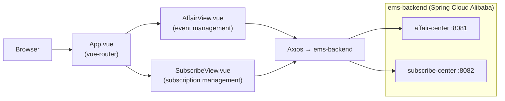

# ems-frontend · Vue 2 Event Management System UI

> **A Vue 2 + Element UI SPA for managing events (affairs) and subscriptions, paired with the ems-backend Spring Cloud Alibaba microservice.**
>
> 基于 Vue 2 + Element UI 的活动管理系统前端，活动管理与订阅管理双视图，配套 ems-backend Spring Cloud Alibaba 微服务。

[English](#english) · [中文](#中文)


---

<a id="english"></a>

## Architecture



## Quickstart

```bash
npm install
npm run serve    # dev server at :8080
npm run build    # production build
```

Backend: point Axios base URL at `ems-backend` affair-center (`:8081`) and subscribe-center (`:8082`).

## Pages

| View | Description |
|---|---|
| `AffairView` | Browse, create, and manage events (activities) |
| `SubscribeView` | Subscribe / unsubscribe to events, view subscription list |

## Roadmap

- [x] Event (affair) management UI
- [x] Subscription management UI
- [ ] Event detail and participant list
- [ ] Real-time notification badge (RocketMQ → WebSocket push)
- [ ] Calendar view for events

---

<a id="中文"></a>

## 中文速读

- **是什么**：活动管理系统（EMS）前端，Vue 2 + Element UI，活动管理（AffairView）+ 订阅管理（SubscribeView），配套 ems-backend 微服务。
- **运行**：`npm install && npm run serve`，后端指向 ems-backend affair-center / subscribe-center。

## License

MIT © [Seal-Re](https://github.com/Seal-Re)

